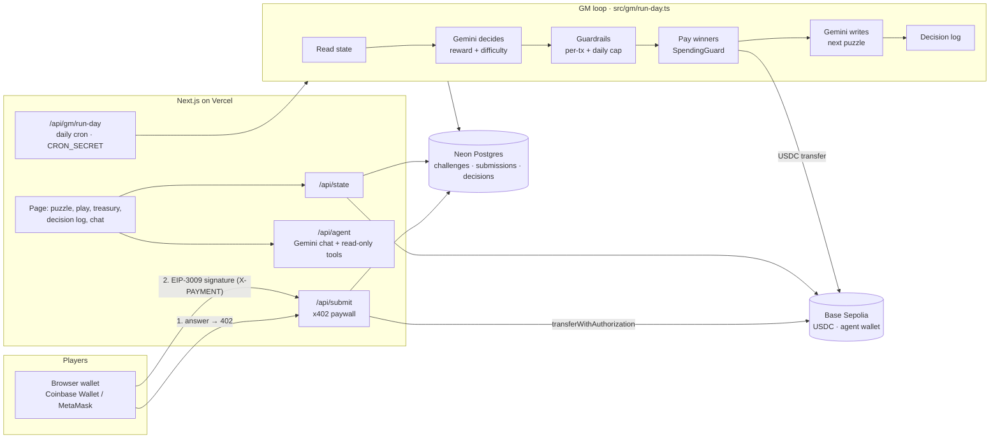

<p align="center">
  
</p>

<h1 align="center">GM Agent</h1>

<p align="center">
  <b>An autonomous AI game master that runs a daily puzzle game and manages its own on-chain treasury.</b><br/>
  <a href="https://gm-agent-lime.vercel.app">Live app</a> ·
  <a href="https://x.com/GMAgentHQ">@GMAgentHQ</a> ·
  Base Sepolia (testnet) ·
  Built for <b>Agentmaxxing</b> by <a href="https://x.com/riseinweb3">@riseinweb3</a> (Oct 2026)
</p>

---

## Project description

GM Agent is an autonomous AI game master. Every day it publishes an original puzzle, players
pay a small **USDC entry fee via x402** to answer, and at the end of the day the agent grades the
answers, **decides how much to pay the winners**, sends the rewards **on-chain from its own
wallet**, tunes tomorrow's difficulty and writes down **why** — with no human operator.

It is built on top of the default Agentmaxxing starter kit (Next.js + Gemini + viem), extended
with real x402 settlement, a Postgres-backed game store, an autonomous daily loop and hard
spending guardrails.

## The problem it solves

Online communities love daily puzzles and prize games, but running one is a chore: someone has to
write fresh puzzles every day, collect entry fees, check answers, decide prize sizes and pay
winners — and do it fairly and without going broke. Prize pools are usually managed by hand,
opaquely, and die when the organizer loses interest.

GM Agent hands that whole job to an AI agent **that holds its own money**:

- **No operator needed** — puzzles, grading, payouts and difficulty tuning happen on a daily cron.
- **Sustainable economics** — too generous and the treasury drains; too stingy and players leave.
  The agent balances income vs. rewards every day, and code-level guardrails make bankruptcy
  impossible (see [Experiments](#experiments)).
- **Transparent and trustless** — every fee and payout is a public USDC transaction, and every
  decision is logged with the agent's own written reasoning.
- **Micro-payments that actually work** — x402 + EIP-3009 lets players pay a 0.10 USDC fee with a
  single gasless signature, no account or approval step.

## Tech stack

| Layer | Technology | Version |
|---|---|---|
| Runtime | Node.js | ≥ 22 |
| Framework | Next.js (App Router) | 16.3.8 |
| UI | React / React DOM | 19.3.0 |
| Styling | Tailwind CSS (+ `@tailwindcss/postcss`) | 4.3.3 |
| Components | shadcn · Base UI · lucide-react | 4.21.1 · 1.8.0 · 1.52.0 |
| Language | TypeScript | 5.9.3 |
| LLM SDK | `@google/genai` (Google Gemini) | 2.27.0 |
| Blockchain | viem | 2.57.2 |
| Network / token | Base Sepolia testnet · Circle USDC (EIP-3009) | chain id 84532 |
| Payments | x402 protocol, `exact` scheme | v1 |
| Database | Neon Postgres (`@neondatabase/serverless`) | 1.2.0 |
| Hosting / cron | Vercel (+ Vercel Cron) | — |
| Testing | Vitest · tsx | 5.0.3 · 4.23.15 |

## Tools

The chat agent ([`agent/tools.ts`](agent/tools.ts)) has **5 built-in tools** that Gemini calls via
function calling:

| # | Tool | What it does |
|---|---|---|
| 1 | `create_challenge` | Publishes a new original puzzle (difficulty, question, private answer key, accepted variants). Only allowed when no day is open. |
| 2 | `get_today_challenge` | Returns the currently open puzzle — never the answer key. |
| 3 | `get_treasury_balance` | Reads the agent wallet's USDC and ETH balance on Base Sepolia, with a BaseScan link. |
| 4 | `get_decision_log` | Reads the GM's own decision log: participants, win rate, income, payouts, treasury before/after and written reasoning. |
| 5 | `get_game_rules` | Returns the rules and economic limits: entry fee, max reward per winner, daily payout budget. |

Chat tools are **read-only with respect to money**. On top of them, the autonomous daily loop
([`src/gm/run-day.ts`](src/gm/run-day.ts)) performs these actions:

| Action | What it does |
|---|---|
| Decide rewards & difficulty | Gemini proposes reward per winner + next difficulty with reasoning (3 personas). |
| Apply guardrails | `SpendingGuard` clamps every proposal to per-tx and daily caps. |
| Pay winners | Real USDC transfers on Base Sepolia from the agent wallet. |
| Author next puzzle | Gemini writes a puzzle; a second, blind Gemini call must solve it or it is rewritten. |
| Settle entry fees | x402 paywall on `/api/submit` settles EIP-3009 authorizations on-chain. |

## Supported AI models

GM Agent runs on **Google Gemini** through `@google/genai` 2.27.0, with automatic model fallback
([`src/llm/gemini.ts`](src/llm/gemini.ts)): on 503 / 429 / network errors each model gets 2
attempts, then the next model in the chain is tried. The model is switchable via env vars.

| Role | Model | Version / alias |
|---|---|---|
| Primary (`GEMINI_MODEL`) | Gemini Flash | `gemini-flash-latest` (latest stable Flash) |
| Fallback 1 | Gemini 2.5 Flash | `gemini-2.5-flash` |
| Fallback 2 | Gemini Flash-Lite | `gemini-flash-lite-latest` |
| No API key / all models down | Rule-based strategy + built-in puzzle bank | — |

Any other Gemini model id can be set via `GEMINI_MODEL` / `GEMINI_FALLBACK_MODELS`.
The economic decision maker also supports three personas (`GM_PERSONA`): `balanced`,
`treasurer`, `entertainer`.

## Key features

- 🧩 **Writes puzzles** — Gemini authors an original riddle; the answer key is stored privately at creation.
  A second, independent Gemini call solves each draft *blind*; if it can't reach the same answer, the
  puzzle is treated as ambiguous and rewritten.
- 💸 **Charges entry fees with x402** — `POST /api/submit` answers `402 Payment Required`; the player
  signs a gasless EIP-3009 USDC authorization; the server **settles it on-chain** into the treasury.
- ✅ **Grades deterministically** — answers are normalized and compared to the stored key, so the LLM
  can never "misremember" its own riddle.
- 🧠 **Makes the economic call** — at day end Gemini sees treasury, income, participation, win rate
  and history, and proposes a reward per winner and the next difficulty, with written reasoning.
- 🛡️ **Is kept honest by guardrails** — max 2 USDC per winner and max 10% of the treasury per day,
  enforced in code (`SpendingGuard`). The LLM proposes; the code disposes.
- 🏦 **Pays winners on-chain** — real USDC transfers on Base Sepolia, every tx linked on the page.
- 📒 **Keeps a public decision log** — what it saw, what it decided, what the guardrails changed, and why.
- 💬 **Talks** — a chat where anyone can ask the GM about today's puzzle, the treasury, or why it paid
  what it paid. Chat tools are read-only; money only moves in the daily loop.
- 🔁 **Resilient** — Gemini retries + model fallback, rule-based fallback when no LLM is available.
- 🧪 **Tested & simulated** — unit tests for every money path and a 30-day economy simulator.

## Demo video

▶️ **Week 1 demo:** _coming soon — link will be added here_ <!-- TODO: replace with the YouTube / Loom link -->

## Demo links

- Week 1 (gmagent.v1): _demo-video-link_ <!-- TODO -->
- Week 2 (gmagent.v2): _coming in Week 2_
- Week 3 (gmagent.v3): _coming in Week 3_

Live app: https://gm-agent-lime.vercel.app

## Future scope

**Week 2 (gmagent.v2)**
- **Player agents over x402** — let other AI agents join the game by paying the entry fee
  programmatically (an x402 client SDK + MCP server exposing `get_puzzle` / `submit_answer`).
- **Model switching in the UI** — pick between Gemini models (and add Claude / OpenAI providers)
  per role: chat, puzzle author, treasurer.
- **Leaderboard & streaks** — per-wallet history, streak bonuses decided by the GM within the caps.
- **Mainnet-ready treasury** — move the agent key to a smart account / KMS signer with on-chain
  spending limits instead of an env var.

**Week 3 (gmagent.v3)**
- **ZK answer commitments** — publish a hash commitment of the answer key at puzzle creation and a
  ZK proof at grading time, so players can verify the GM didn't change the answer after the fact.
- **Sponsored prize pools** — anyone can top up the treasury via x402 and the GM accounts for it.
- **Multiple game modes** — trivia, word games and multi-day tournaments run by the same agent.
- **Onchain decision log** — anchor each day's decision hash on Base for tamper-evident accounting.

## Social media

- X / Twitter: [@GMAgentHQ](https://x.com/GMAgentHQ)
- Built for Agentmaxxing by [@riseinweb3](https://x.com/riseinweb3)
- GitHub: [BerkeBakir/gm-agent](https://github.com/BerkeBakir/gm-agent)

## Architecture



| Path | What it is |
|---|---|
| [`src/gm/run-day.ts`](src/gm/run-day.ts) | The daily loop: state → decide → guardrails → pay → next puzzle → log. Cron, admin button and simulator all call this. |
| [`src/gm/gemini.ts`](src/gm/gemini.ts) | Gemini decision maker (3 personas) and puzzle author, structured JSON output. |
| [`src/gm/policy.ts`](src/gm/policy.ts) | Hard guardrails applied to every proposal. |
| [`src/gm/strategies.ts`](src/gm/strategies.ts) | Rule-based strategies for experiments and as LLM fallback. |
| [`src/x402/exact.ts`](src/x402/exact.ts) | x402 `exact` scheme: requirements, EIP-3009 signing, verification, on-chain settlement. |
| [`src/wallet/`](src/wallet/) | `Wallet` interface, `BaseSepoliaWallet` (real USDC), `MockWallet` (sims), `SpendingGuard`. |
| [`src/game/`](src/game/) | Challenges, submissions, decision log; in-memory and Neon Postgres stores; answer checking. |
| [`src/sim/simulate.ts`](src/sim/simulate.ts) | Off-chain economy simulator with bot players. |
| [`agent/`](agent/) | Agent loop + chat tools (from the Agentmaxxing starter kit, adapted). |
| [`app/`](app/) | Next.js page and API routes. |

## Crypto integration

All money is **USDC on Base Sepolia** (Circle's testnet USDC, `0x036C…CF7e`), so income and
expenses share one unit. ETH is only used for gas, paid by the agent.

### Entry fee: x402, settled on-chain

The starter kit's x402 demo only *signs* payments. GM Agent **settles** them:

1. `POST /api/submit {answer}` → `402` with x402 v1 `PaymentRequirements`
   (`scheme: "exact"`, `network: "base-sepolia"`, `maxAmountRequired: "100000"`, `payTo: <agent>`, `asset: USDC`).
2. The player's wallet signs an EIP-712 `TransferWithAuthorization` (EIP-3009) — **no gas, no approve**.
3. The client retries with `X-PAYMENT: base64(json)`.
4. The server checks recipient, amount, validity window, signature and that the nonce is unused
   (on-chain `authorizationState`), refuses duplicates **before** charging, then calls
   `transferWithAuthorization` on the USDC contract from the agent wallet.
5. `200` + `X-PAYMENT-RESPONSE` with the settlement tx. The fee is now in the treasury.

Verified against the real Base Sepolia USDC contract: a valid signature passes signature checks,
a tampered amount fails with `FiatTokenV2: invalid signature`.

### Rewards: real transfers, behind a spending guard

At day end every payout goes through `SpendingGuard` (`src/wallet/spending-guard.ts`):
per-transfer cap and a daily cap of 10% of the start-of-day treasury. Each payout's tx hash is
stored and shown in the decision log with a BaseScan link.

### Why this is meaningful, not bolted on

Without the wallet there is no game: the treasury is the GM's score, entry fees are its income,
rewards are its spending, and the decision log is its accounting. The agent's core job — keep the
game alive and fun without going broke — only exists because it holds money.

## Experiments

Full write-up: **[docs/experiments.md](docs/experiments.md)**. 30 simulated days, 40 bot players,
50 USDC starting treasury, same seeds for every strategy:

| Strategy | Final treasury | Bankrupt runs | Last-week players | Difficulty switches |
|---|---:|---:|---:|---:|
| fixed | 22.18 | 0/5 | 22.2 | 1.0 |
| generous | 18.90 | 0/5 | 17.9 | 0.0 |
| stingy | 78.46 | 0/5 | 8.5 | 1.0 |
| adaptive | 27.63 | 0/5 | 22.9 | 22.8 |
| adaptive-v2 (hysteresis) | 27.57 | 0/5 | 23.0 | 11.0 |
| generous, **no daily cap** | 0.06 | **5/5** | 16.3 | 0.0 |

Key findings: the hard daily cap is what prevents bankruptcy (5/5 → 0/5); stingy keeps money but
loses players; generous makes the game boring; the first adaptive controller oscillated and was
fixed with hysteresis.

## Run it locally

Requirements: Node 22+, a free [Gemini API key](https://aistudio.google.com/apikey).

```bash
git clone https://github.com/BerkeBakir/gm-agent && cd gm-agent
npm install
cp .env.example .env        # add GEMINI_API_KEY; WALLET_PRIVATE_KEY optional (or use "Create wallet")
npm run dev:memory          # in-memory store, http://localhost:3000
```

Useful scripts:

| Command | What it does |
|---|---|
| `npm test` | Unit tests (store, answers, guardrails, run-day loop, x402, simulator) |
| `npm run simulate` | Strategy experiments → `docs/sim/` |
| `npm run balance -- 0xAddr` | Read ETH + USDC balance of any address on Base Sepolia |
| `npm run dev` | Dev server using `DATABASE_URL` if set (Postgres) |

To close a day manually: open the **Operator** panel on the page and use the `CRON_SECRET` token,
or `curl -X POST -H "Authorization: Bearer $CRON_SECRET" localhost:3000/api/gm/run-day`.

### Environment

| Variable | Purpose |
|---|---|
| `GEMINI_API_KEY` | LLM for chat, decisions and puzzles (without it, rule-based fallback + puzzle bank) |
| `GEMINI_MODEL` | Default `gemini-flash-latest` |
| `GEMINI_FALLBACK_MODELS` | Tried in order on 503/429/network errors. Default `gemini-2.5-flash,gemini-flash-lite-latest` |
| `WALLET_PRIVATE_KEY` | Agent treasury key (testnet only). Required on Vercel. |
| `DATABASE_URL` | Neon Postgres (auto-set by the Vercel Neon integration) |
| `CRON_SECRET` | Protects `/api/gm/run-day` (Vercel Cron sends it automatically) |
| `ENTRY_FEE_USDC` | Default `0.10` |
| `MAX_REWARD_PER_TX` / `MAX_DAILY_TREASURY_FRACTION` | Guardrails, default `2.00` / `0.10` |
| `GM_PERSONA` | `balanced` (default), `treasurer` or `entertainer` |

## Security notes

- **Testnet only.** No real funds; the agent key lives in env vars, never in git.
- **Money can't be moved from chat.** Chat tools are read-only; payouts only happen in the
  `CRON_SECRET`-protected daily loop.
- **The LLM can't overspend.** Per-tx and daily caps are enforced in code after the LLM decides.
- **The answer key never leaves the server** while a puzzle is open (`toPublicChallenge` strips it;
  tested). The system prompt also forbids revealing it.
- **One answer per wallet per day**, enforced by a unique index; duplicates are rejected *before*
  the entry fee is settled. The entry fee makes Sybil spam cost money.

## Built on

[Agentmaxxing starter kit](https://www.npmjs.com/package/agentmaxxin) (Next.js + Gemini + viem),
[x402](https://x402.org), EIP-3009 USDC, [Neon](https://neon.tech), [Vercel](https://vercel.com).

Design doc (Turkish): [docs/proje-gm-agent.md](docs/proje-gm-agent.md).
