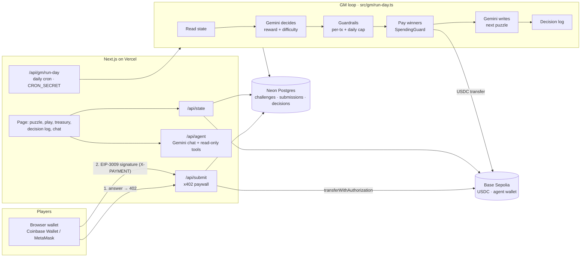

# GM Agent — an AI game master with its own treasury

**Live:** https://gm-agent-lime.vercel.app · **Network:** Base Sepolia (testnet) · Built for **Agentmaxxing** (Rise In, Oct 2026)

GM Agent is an autonomous AI game master. Every day it publishes an original puzzle, players
pay a small **USDC entry fee via x402** to answer, and at the end of the day the agent grades the
answers, **decides how much to pay the winners**, sends the rewards **on-chain from its own
wallet**, tunes tomorrow's difficulty and writes down **why** — with no human operator.

The interesting part is the economics. If the GM is too generous, the treasury drains and the
game dies. If it is too stingy, players leave and income dries up. So the agent doesn't just answer
questions: it runs a small economy, inside hard limits enforced in code.

## What it does

- 🧩 **Writes puzzles** — Gemini authors an original riddle; the answer key is stored privately at creation.
  A second, independent Gemini call solves each draft *blind*; if it can't reach the same answer, the
  puzzle is treated as ambiguous and rewritten.
- 💸 **Charges entry fees with x402** — `POST /api/submit` answers `402 Payment Required`; the player
  signs a gasless EIP-3009 USDC authorization; the server **settles it on-chain** into the treasury.
- ✅ **Grades deterministically** — answers are normalized and compared to the stored key, so the LLM
  can never "misremember" its own riddle.
- 🧠 **Makes the economic call** — at day end Gemini sees treasury, income, participation, win rate
  and history, and proposes a reward per winner and the next difficulty, with written reasoning.
- 🛡️ **Is kept honest by guardrails** — max 2 USDC per winner and max 10% of the treasury per day,
  enforced in code (`SpendingGuard`). The LLM proposes; the code disposes.
- 🏦 **Pays winners on-chain** — real USDC transfers on Base Sepolia, every tx linked on the page.
- 📒 **Keeps a public decision log** — what it saw, what it decided, what the guardrails changed, and why.
- 💬 **Talks** — a chat where anyone can ask the GM about today's puzzle, the treasury, or why it paid
  what it paid. Chat tools are read-only; money only moves in the daily loop.

## Architecture



| Path | What it is |
|---|---|
| [`src/gm/run-day.ts`](src/gm/run-day.ts) | The daily loop: state → decide → guardrails → pay → next puzzle → log. Cron, admin button and simulator all call this. |
| [`src/gm/gemini.ts`](src/gm/gemini.ts) | Gemini decision maker (3 personas) and puzzle author, structured JSON output. |
| [`src/gm/policy.ts`](src/gm/policy.ts) | Hard guardrails applied to every proposal. |
| [`src/gm/strategies.ts`](src/gm/strategies.ts) | Rule-based strategies for experiments and as LLM fallback. |
| [`src/x402/exact.ts`](src/x402/exact.ts) | x402 `exact` scheme: requirements, EIP-3009 signing, verification, on-chain settlement. |
| [`src/wallet/`](src/wallet/) | `Wallet` interface, `BaseSepoliaWallet` (real USDC), `MockWallet` (sims), `SpendingGuard`. |
| [`src/game/`](src/game/) | Challenges, submissions, decision log; in-memory and Neon Postgres stores; answer checking. |
| [`src/sim/simulate.ts`](src/sim/simulate.ts) | Off-chain economy simulator with bot players. |
| [`agent/`](agent/) | Agent loop + chat tools (from the Agentmaxxing starter kit, adapted). |
| [`app/`](app/) | Next.js page and API routes. |

## Crypto integration

All money is **USDC on Base Sepolia** (Circle's testnet USDC, `0x036C…CF7e`), so income and
expenses share one unit. ETH is only used for gas, paid by the agent.

### Entry fee: x402, settled on-chain

The starter kit's x402 demo only *signs* payments. GM Agent **settles** them:

1. `POST /api/submit {answer}` → `402` with x402 v1 `PaymentRequirements`
   (`scheme: "exact"`, `network: "base-sepolia"`, `maxAmountRequired: "100000"`, `payTo: <agent>`, `asset: USDC`).
2. The player's wallet signs an EIP-712 `TransferWithAuthorization` (EIP-3009) — **no gas, no approve**.
3. The client retries with `X-PAYMENT: base64(json)`.
4. The server checks recipient, amount, validity window, signature and that the nonce is unused
   (on-chain `authorizationState`), refuses duplicates **before** charging, then calls
   `transferWithAuthorization` on the USDC contract from the agent wallet.
5. `200` + `X-PAYMENT-RESPONSE` with the settlement tx. The fee is now in the treasury.

Verified against the real Base Sepolia USDC contract: a valid signature passes signature checks,
a tampered amount fails with `FiatTokenV2: invalid signature`.

### Rewards: real transfers, behind a spending guard

At day end every payout goes through `SpendingGuard` (`src/wallet/spending-guard.ts`):
per-transfer cap and a daily cap of 10% of the start-of-day treasury. Each payout's tx hash is
stored and shown in the decision log with a BaseScan link.

### Why this is meaningful, not bolted on

Without the wallet there is no game: the treasury is the GM's score, entry fees are its income,
rewards are its spending, and the decision log is its accounting. The agent's core job — keep the
game alive and fun without going broke — only exists because it holds money.

## Experiments

Full write-up: **[docs/experiments.md](docs/experiments.md)**. 30 simulated days, 40 bot players,
50 USDC starting treasury, same seeds for every strategy:

| Strategy | Final treasury | Bankrupt runs | Last-week players | Difficulty switches |
|---|---:|---:|---:|---:|
| fixed | 22.18 | 0/5 | 22.2 | 1.0 |
| generous | 18.90 | 0/5 | 17.9 | 0.0 |
| stingy | 78.46 | 0/5 | 8.5 | 1.0 |
| adaptive | 27.63 | 0/5 | 22.9 | 22.8 |
| adaptive-v2 (hysteresis) | 27.57 | 0/5 | 23.0 | 11.0 |
| generous, **no daily cap** | 0.06 | **5/5** | 16.3 | 0.0 |

Key findings: the hard daily cap is what prevents bankruptcy (5/5 → 0/5); stingy keeps money but
loses players; generous makes the game boring; the first adaptive controller oscillated and was
fixed with hysteresis.

## Run it locally

Requirements: Node 20+, a free [Gemini API key](https://aistudio.google.com/apikey).

```bash
git clone https://github.com/BerkeBakir/gm-agent && cd gm-agent
npm install
cp .env.example .env        # add GEMINI_API_KEY; WALLET_PRIVATE_KEY optional (or use "Create wallet")
npm run dev:memory          # in-memory store, http://localhost:3000
```

Useful scripts:

| Command | What it does |
|---|---|
| `npm test` | Unit tests (store, answers, guardrails, run-day loop, x402, simulator) |
| `npm run simulate` | Strategy experiments → `docs/sim/` |
| `npm run balance -- 0xAddr` | Read ETH + USDC balance of any address on Base Sepolia |
| `npm run dev` | Dev server using `DATABASE_URL` if set (Postgres) |

To close a day manually: open the **Operator** panel on the page and use the `CRON_SECRET` token,
or `curl -X POST -H "Authorization: Bearer $CRON_SECRET" localhost:3000/api/gm/run-day`.

### Environment

| Variable | Purpose |
|---|---|
| `GEMINI_API_KEY` | LLM for chat, decisions and puzzles (without it, rule-based fallback + puzzle bank) |
| `GEMINI_MODEL` | Default `gemini-flash-latest` |
| `GEMINI_FALLBACK_MODELS` | Tried in order on 503/429/network errors. Default `gemini-2.5-flash,gemini-flash-lite-latest` |
| `WALLET_PRIVATE_KEY` | Agent treasury key (testnet only). Required on Vercel. |
| `DATABASE_URL` | Neon Postgres (auto-set by the Vercel Neon integration) |
| `CRON_SECRET` | Protects `/api/gm/run-day` (Vercel Cron sends it automatically) |
| `ENTRY_FEE_USDC` | Default `0.10` |
| `MAX_REWARD_PER_TX` / `MAX_DAILY_TREASURY_FRACTION` | Guardrails, default `2.00` / `0.10` |
| `GM_PERSONA` | `balanced` (default), `treasurer` or `entertainer` |

## Security notes

- **Testnet only.** No real funds; the agent key lives in env vars, never in git.
- **Money can't be moved from chat.** Chat tools are read-only; payouts only happen in the
  `CRON_SECRET`-protected daily loop.
- **The LLM can't overspend.** Per-tx and daily caps are enforced in code after the LLM decides.
- **The answer key never leaves the server** while a puzzle is open (`toPublicChallenge` strips it;
  tested). The system prompt also forbids revealing it.
- **One answer per wallet per day**, enforced by a unique index; duplicates are rejected *before*
  the entry fee is settled. The entry fee makes Sybil spam cost money.

## Built on

[Agentmaxxing starter kit](https://www.npmjs.com/package/agentmaxxin) (Next.js + Gemini + viem),
[x402](https://x402.org), EIP-3009 USDC, [Neon](https://neon.tech), [Vercel](https://vercel.com).

Design doc (Turkish): [docs/proje-gm-agent.md](docs/proje-gm-agent.md).
