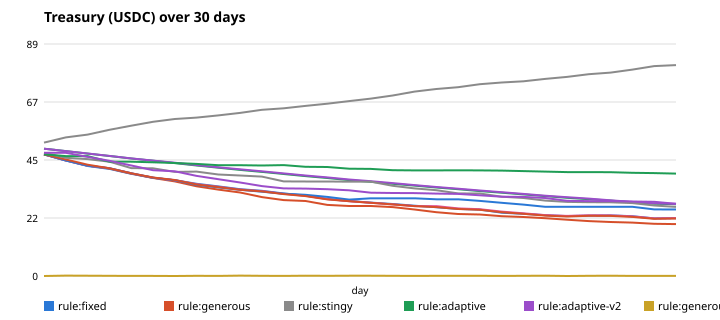
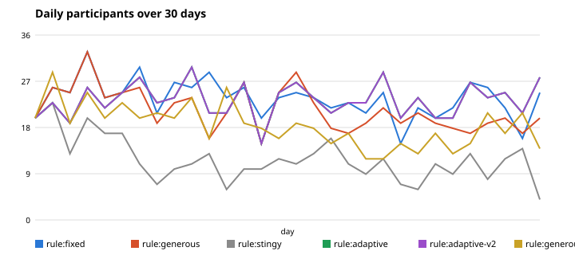

# Experiments

GM Agent has to make a real economic trade-off every day: pay winners too much and the
treasury drains; pay too little and players stop coming (and entry-fee income falls).
These experiments measure how different decision makers handle that trade-off.

Reproduce everything with:

```bash
npm run simulate            # rule-based strategies, 5 seeds each (seconds, free)
npm run simulate -- --llm   # + Gemini personas (needs GEMINI_API_KEY)
```

Raw data: [`docs/sim/results.json`](sim/results.json) and one CSV per strategy in [`docs/sim/`](sim/).

## Setup

The simulator runs the **real** `runDay()` loop (same code as production: guardrails,
`SpendingGuard`, decision log) against an in-memory store and a `MockWallet`, so a 30-day
run takes milliseconds and costs nothing. Only the wallet and the players are simulated.

| Parameter | Value |
|---|---|
| Days | 30 |
| Potential players | 40 bots |
| Starting treasury | 50 USDC |
| Entry fee (x402) | 0.10 USDC |
| Hard limits | max 2 USDC per winner, max 10% of treasury per day |
| Target win rate | 30–50% |
| Seeds | 5 per rule-based strategy (results are averages) |

**Player model.** Each bot has a skill (uniform 0.2–0.9) and an *interest* (probability of
playing today, starts at 0.5). P(correct) = skill + 0.30 on easy, +0 on medium, −0.35 on hard.
After every day, interest drifts toward how worthwhile the game felt — the expected value of
playing (`win rate × reward − fee`) passed through a sigmoid — with a penalty when the puzzle
was boring (win rate > 85%) or hopeless (< 10%). It is deliberately simple; the point is to
compare strategies under the same conditions, not to predict real players.

## Strategies

| Strategy | Reward per winner | Difficulty |
|---|---|---|
| `fixed` | always 0.50 USDC | always medium |
| `generous` | the whole daily budget, split across winners | always easy |
| `stingy` | 0.05 USDC | always hard |
| `adaptive` | today's income + 2% of treasury, split | one step toward the target band every day |
| `adaptive-v2` | same as adaptive | moves only if far outside the band or outside two days in a row |
| `generous-no-cap` | same as generous, **with the 10% daily cap removed** (ablation) | always easy |
| `gemini:*` | Gemini decides (3 personas × 2 prompt versions) | Gemini decides |

## Results (30 days, mean of 5 seeds)

| Strategy | Final treasury | Bankrupt runs | Avg players/day | Last-week players | Paid out | Fee income | Days in 30–50% band | Difficulty switches |
|---|---:|---:|---:|---:|---:|---:|---:|---:|
| fixed | 22.18 | 0/5 | 23.4 | 22.2 | 98.08 | 70.26 | 11.2 | 1.0 |
| generous | 18.90 | 0/5 | 20.0 | 17.9 | 90.96 | 59.86 | 0.0 | 0.0 |
| stingy | **78.46** | 0/5 | 10.7 | **8.5** | 3.70 | 32.16 | 7.8 | 1.0 |
| adaptive | 27.63 | 0/5 | 22.6 | 22.9 | 90.03 | 67.66 | 6.6 | **22.8** |
| adaptive-v2 | 27.57 | 0/5 | 22.6 | **23.0** | 90.27 | 67.84 | 7.8 | 11.0 |
| generous-no-cap | **0.06** | **5/5** | 16.8 | 16.3 | 100.48 | 50.54 | 0.0 | 0.0 |

All amounts in USDC. "Bankrupt" = treasury fell below 10 entry fees.




## Findings

1. **The hard guardrail is what keeps the game alive.** The same generous strategy with the
   10%-per-day cap removed went bankrupt in **5 out of 5** runs; with the cap, in 0 out of 5.
   This is why the cap lives in code (`SpendingGuard` + `applyGuardrails`) and not in the
   prompt: the LLM proposes, the code disposes.
2. **Being stingy "wins" on money and loses the game.** `stingy` ends with the richest treasury
   (78 USDC, it actually *grows*), but daily players fall to ~8 of 40 by the last week.
   A treasury nobody plays against is not a success.
3. **Generous is not even good for players.** Easy puzzles + big rewards push win rate to ~85%;
   the game becomes boring, interest drops, and income falls — so `generous` ends with *fewer*
   players than `fixed` and a smaller treasury.
4. **Adaptive v1 oscillated — and we fixed it.** With only three difficulty levels and daily
   noise from ~20 players, "move one step toward the band every day" bounced medium↔hard almost
   daily (22.8 switches in 30 days). Adding hysteresis (`adaptive-v2`) halved the switching
   (11.0) and slightly improved time in the target band (6.6 → 7.8 days) with the same economics.
5. **The target band is hard to hit with coarse difficulty.** Even the best strategy spends only
   about a third of days inside 30–50%. Medium lands near 55% for this population and hard near
   20%; the band sits *between* the levels. A finer difficulty scale (or letting the LLM tune the
   puzzle itself, not just pick a level) is the obvious next step.
6. **Sustainable payout ≈ income + a small slice of treasury.** The adaptive strategies pay
   "today's fees + 2% of treasury" and keep the player base highest in the last week while
   losing treasury slowly and predictably — a shape an operator can plan around.

## Gemini personas

`npm run simulate -- --llm` runs the same 30 days (seed 1) with Gemini making every end-of-day
decision, for 3 personas (`balanced`, `treasurer`, `entertainer`) and 2 prompt versions. The LLM's
day-by-day reasoning is in `docs/sim/gemini-*.csv`. All runs below had **0 fallbacks** (every
decision was really made by Gemini).

| Gemini run | Final treasury | Last-week players | Paid out | Days in band | Difficulty switches |
|---|---:|---:|---:|---:|---:|
| balanced, prompt v1 | 22.29 | 22.4 | 99.31 | 13 | 23 |
| treasurer, prompt v1 | 25.61 | 22.1 | 94.79 | 10 | 23 |
| entertainer, prompt v1 | 22.14 | 22.4 | 99.46 | 13 | 23 |
| balanced, prompt v2 | 26.60 | 23.0 | 89.70 | 8 | 23 |
| **treasurer, prompt v2** | **39.43** | 20.3 | 73.87 | 9 | 22 |
| entertainer, prompt v2 | 27.78 | 20.6 | 90.22 | 11 | 19 |

**What we saw with prompt v1.** The personas barely mattered: "conservative treasurer" and
"fun-first entertainer" paid almost the same. Reading the reasoning, Gemini anchored on the hard
limit — it often set the reward to exactly `daily budget ÷ winners` ("0.4 USDC, as the daily budget of
5.2 USDC divided by 13 winners"). It also flipped difficulty medium↔hard almost every day, i.e. it
reproduced the naive `adaptive` controller.

**Prompt v2** added two lessons from the rule-based experiments: *the daily budget is a ceiling, not
a target — a sustainable payout is about income + 2% of treasury*, and *don't change difficulty on one
noisy day*.

- ✅ **The economic lesson worked.** Payouts dropped and the personas finally diverged: the v2
  treasurer ended with **39.4 USDC vs 25.6** under v1 (and vs 27.6 for the best rule-based strategy),
  at the cost of ~2 fewer daily players in the last week.
- ❌ **The control lesson did not.** Difficulty switches stayed at 19–23. Gemini explains each day's
  move sensibly in isolation but doesn't apply a rule that depends on yesterday.
- **Takeaway:** an LLM is good at the *judgment* part (how generous to be, explained in words) and
  unreliable at *stateful control rules*. Same conclusion as the spending cap: anything that must
  always hold belongs in code. The natural next step is enforcing difficulty hysteresis in code, like
  the budget guardrail, and letting Gemini decide only within it.

Caveat: one seed per Gemini run (LLM calls are slow and rate-limited), so treat differences of a few
USDC as noise; the v1→v2 treasurer gap and the unchanged switching are large enough to be meaningful.

Production uses prompt v2 with the `balanced` persona.

## Failures found along the way

- **Adaptive oscillation** (above) — found by the simulator, fixed with hysteresis.
- **Over-paying is impossible by construction** — a test (`test/run-day.test.ts`) feeds a decider
  that asks for 50 USDC per winner; guardrails cap it at 2 USDC and log the adjustment.
- **The agent can't misgrade its own riddle** — the answer key is stored when the puzzle is
  created and grading is deterministic, so the LLM never has to "remember" the answer.
